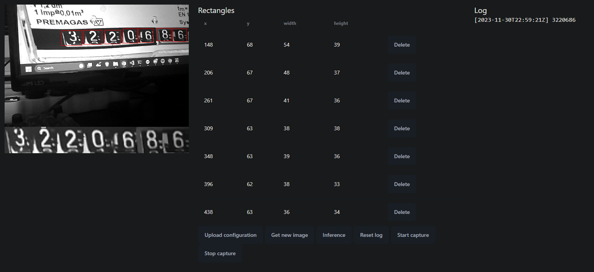

# IMP Projekt

S - ARM@FITkit3, ESP32 či jiný HW: Demo aplikace strojového učení (pomocí ArmNN, TinyML, TensorFlow Lite apod.)

Autor: Josef Kuchař (xkucha28)

## Úvod do problému

Cílem toho projektu je automatický odečet hodnot z plynoměru. Kontrolní odečty se hodí při změně smlouvy, zafixování cen a podobně. Pro uživatele je jednodušší, když je tato činnost automatizovaná a nemusí tak na ní myslet.

Automatický odečet lze u plynoměru dělat dvěma způsoby:

1. Opticky, například kamerou
2. Snímáním magnetických impulzů (1 puls = 0,01 m³) například pomocí hallové sondy

V tomto projektu jsem zvolil možnost první. Je tomu tak z důvodu, že všechny zařízení nemusí generovat magnetické pulzy, je třeba nastavit počáteční offset a žádný puls se nesmí vynechat, jinak dojde k odchylce od reálné hodnoty. Druhý důvod je samozřejmě splnění zadání a to využítí strojového učení.

Moje řešení také vyžaduje počáteční nastavení, avšak poté již uživatel nemusí nijak zasahovat a vždy se čte celá absolutní hodnota.

Uživatel vhodně umístí zařízení, aby kamera směrovala na daný plynoměr a poté veškeré nastavení dělá na dálku. Pomocí webového prohlížeče navštíví IP adresu zařízení. Zobrazí se webová stránka s uživatelským rozhraním pro nastavení pozic číslic viz obrázek. Po nastavení stačí nahrát konfiguraci pomocí tlačítka `Upload configuration`. Pro ověření funkčnosti lze stisknout tlačítko `Inference`, kterým se provede testovací odečet. Po kontrole funkčnosti může uživatel zahájit automaticky odečet pomocí tlačítka `Start capture`. Odečtené hodnoty se zobrazí na stejné stránce, případně v souboru `/log.txt` na stejné IP adrese.

## Popis řešení

Projekt se dělí na dvě části: embedded část a webovou část.

### Embedded část

Projekt běží na platformě ESP32. Konkrétně modulu Ai Thinker ESP32-CAM. Tento modul obsahuje kameru, která je využita pro snímání číslic. Jako framework pro vývoj byl zvolen Arduino - PlatformIO. Tento framework umožňuje snadnou práci s ESP32 a využití knihoven pro tento mikrokontroler.

#### Webserver

Na mikrokontroleru běží web server, který zpřístupňuje jednoduché webové rozhraní. Toto rozhraní slouží pro nastavení pozic číslic a následné spuštění automatického odečtu. Webové server je imlementován pomocí knihovny ESPAsyncWebServer. Zpřítupňuje API, se kterým komunikuje webové rozhraní, které je popsáno v další části.

#### Kamera

Obrázky z kamery jsou získávány pomocí driveru esp_camera. Pro jednoduchou práci s vyfocenými obrázky pracuje kamera v režimu Grayscale 1BPP (černobílý 8bit obrázek). Je zvoleno rozlišení 480x320.

#### Rozpoznávání číslic

Pro rozpoznávání číslic je použit natrénovaný model konvoluční neuronové sítě. Model je převeden do formátu TFLite. Model je uložen v souboru `model_data.cc` a je načítán při startu aplikace. Běhové rozhraní modelu je implementováno pomocí knihovny Tensorflow Lite for Microcontrollers.

Při příchodu požadavku na rozpoznání číslic je vyfocen obrázek z kamery. Z obrázku se získají části obsahující číslice pomocí nastavených souřadnic. Tyto části jsou zmenšeny (nebo zvětšeny) na rozlišení 28x28 pomocí bilineární interpolace. Zmenšené části jsou převedeny na float formát a následně předány modelu. Takto je zpracovaná každá číslice. Celý výsledek je pak převeden na jedno číslo.

#### Souborový systém

Jako souborový systém je použit LittleFS, který je spolehlivější než SPIFFS.

V souborovém systému je uložena konfigurace zařízení a logy. Konfigurace je uložena v souboru `/config.json`. Logy jsou uloženy v souboru `/log.txt`. Logy obsahují datum a čas odečtu, odečtenou hodnotu.

Konfigurace obsahuje souřadnice částí obrázku, ve kterých se nachází číslice. Konfigurace je uložena v JSON formátu. Při startu aplikace je konfigurace načtena a při změně konfigurace je uložena zpět do souboru. Zpracování JSON formátu je implementováno pomocí knihovny ArduinoJson.

#### Využité knihovny

##### TensorFlow Lite for Microcontrollers

[Dokumentace](https://www.tensorflow.org/lite/microcontrollers)
[Platformio knihovna](<https://registry.platformio.org/libraries/trylaarsdam/Tensorflow%20Lite%20for%20Microcontrollers%20(WCL)>)

Implementace knihovny Tensorflow Lite for Microcontrollers pro PlatformIO. Slouží ke spouštění natrénovaného modelu.

##### ESP32 Camera Driver

[Platformio knihovna](https://registry.platformio.org/libraries/espressif/esp32-camera)

Driver kamery připojené k ESP32. Umožňuje z kamery získat obrázky v různých rozlišeních a formátech.

##### ESPAsyncWebServer

[Platformio knihovna](https://registry.platformio.org/libraries/ottowinter/ESPAsyncWebServer-esphome)

Asynchronní implementace webového serveru. Webový server zpřístupňuje jednoduché webové stránky, které slouží pro konfiguraci chodu celé aplikace.

##### ArduinoJson

[Platformio knihovna](https://registry.platformio.org/libraries/bblanchon/ArduinoJson)

Knihovna pro serializaci a deserializaci JSON formátu. Využitá pro parsování konfigurace poslané z webového rozhraní.

##### NtpClient

[Platformio knihovna](https://github.com/taranais/NTPClient)

Slouží k získání reálného času z internetu pomocí NTC protokolu. Získaný datum a čas se zapíše do logů společně s načerpanými daty.

#### Další použité zdroje

##### Kód bilineární interpolace

[https://rosettacode.org/wiki/Bilinear_interpolation#C](https://rosettacode.org/wiki/Bilinear_interpolation#C)

Původní kód pro bilinerání interpolaci sloužící k zvětšování a zmenšování obrázků do požadovaného rozlišení 28x28 byl převzat ze stránky rossetacode.org.

Byly provedeny úpravy - práce pouze s černobílým 8bit obrázkem, oprava chyby, získávání pouze části původního obrázku definované souřadnicemi.

##### Datová sada TMIST

[https://www.kaggle.com/datasets/nimishmagre/tmnist-typeface-mnist](https://www.kaggle.com/datasets/nimishmagre/tmnist-typeface-mnist)

Tato datová sada byla použita k natrénovaní konvoluční neuronové sítě použité pro rozpoznávání čísel.

##### Python notebook pro natrénování modelu

[https://www.kaggle.com/code/stpeteishii/tmnist-conv2d/notebook](https://www.kaggle.com/code/stpeteishii/tmnist-conv2d/notebook)

Tento Python notebook je použit k natrénování použité konvoluční neuronové sítě.

Je přidána konverze do formátu TFLite, následná quantizace do 8bit pro rychlejší provádění modelu a úsporu místa.

### Webová část

Webová část slouží ke konfiguraci chodu zařízení. Webové rozhraní je implementováno pomocí frameworku Svelte. Framework Svelte je zvolen z důvodu jednoduchosti a rychlosti.

Styl webového rozhraní je implementován pomocí CSS frameworku DaisyUI. Tento framework je postaven na TailwindCSS a obsahuje hotové komponenty, které jsou použity v tomto projektu.

#### Komunikace s embedded částí

Komunikace s embedded částí je implementována pomocí HTTP protokolu. Webové rozhraní posílá požadavky na IP adresu zařízení. Zařízení odpovídá na požadavky a posílá odpovědi.

#### Vykreslování náhledu kamery

Jelikož kamera fotí ve Grayscale 1BPP, je potřeba obrázek převést do formátu RGB. Toto je ručně implementováno a následně je obrázek vykreslen do HTML canvas elementu.

Pro dobrou předtavu jsou zobrazeny i části obrázku, které budou použity pro rozpoznávání číslic. Tyto části jsou vykresleny do samostatného HTML canvas elementu.

#### Označování částí obrázku

K označování částí obrázku slouží stejný canvas element jako k zobrazení náhledu kamery. Při stisknutí levého tlačítka myši se zaznamená počáteční souřadnice a při uvolnění se zaznamená konečná souřadnice. Pomocí těchto souřadnic je zobrazen obdélník, který označuje část obrázku, ve které se nachází číslice. Po označení všech částí je možné nahrát konfiguraci na zařízení.

#### Nahrání webového rozhraní do zařízení

Celá webová konfigurace je pomocí Vite bundleru zkompilována a následně jsou výsledné soubory zkomprimovány do formátu gzip. Všechny soubory jsou umístěny do složky `/data`. Tato složka je následně pomocí tlačítka `Build Filesystem Image` převedena do formátu LittleFS. Tento binární soubor je nahrán pomocí tlačítka `Upload Filesystem Image` do zařízení.

#### Využité knihovny

##### Svelte

[Webové stránky](https://svelte.dev/)

Jednoduchý framework pro vytváření interaktivních webových aplikací.

##### TailwindCSS

[Webové stránky](https://tailwindcss.com/)

CSS framework sloužící ke snadnému stylování pomocí předpřipravených CSS tříd.

##### DaisyUI

[Webové stránky](https://daisyui.com/)

Soubor hotových komponent (tlačítek a podobně) postavený na TailwindCSS frameworkem.

##### Vite

[Webové stránky](https://vitejs.dev/)

Rychlý místní vývojový server, bundler.

##### Vite plugin compression 2

[Github repozitář](https://github.com/nonzzz/vite-plugin-compression)

Plugin do Vite, který komprimuje výsledné soubory do formátu gzip pro úsporu místa na mikrokontroleru.

### Struktura projektu

- `src/` Zdrojové kódy části běžící na ESP32
  - `camera_config.h` Nastavení kamery
  - `image_manipulation.{h|cpp}` Implementace bilinární interpolace
  - `model_data.{h|cpp}` Převedený uint8 model
  - `main.cpp` Hlavní kód aplikace
- `train/` Python notebook s kódem pro natrénování modelu
- `web/` Zdrojové kódy webového rozhraní
  - `src/App.svelte` Hlavní kód webového rozhraní

## Zhodnocení

Projekt byl jako celek testován jak na reálném zařízení, tak na obrázcích získaných z internetu. V obou případech byl dosažen velmi dobrý výsledek, avšak v některých případech byl problém s rozpoznáním některých číslic z důvodu různých fontů.

### Místo pro zlepšení

Hlavním místem pro zlepšení by byla augmentace datové sady například rotací číslic, přidáním umělých nečistot a podobně. Tím by se nejspíše zlepšila přesnost modelu v reálných podmínkách. Toto zlepšení nebylo implementováno.

Další možností by bylo použít model natrénovaný přímo na konkrétních zařízeních, které by byly použity. Tím by se zlepšila přesnost modelu, avšak by se ztratila univerzálnost.

### Autoevaluace

14; Mám pocit, že jsem k projektu přistupoval zodpovědně, jedná se o poměrně rozsáhlé kvalitní funkční řešení.
